# 📦 Product API — Node.js, Express & MongoDB

A small but **production-shaped** REST API for managing products (Create, Read, Update, Delete).  
Built with **Node.js**, **Express 5**, **MongoDB** (via **Mongoose**), and a clean **MVC** folder layout.

> 👋 **Total beginner?** Start with the section ["What even is an API?"](#-what-even-is-an-api) below, then come back here.

---

## 📚 Table of Contents

1. [What even is an API?](#-what-even-is-an-api)
2. [What does this project do?](#-what-does-this-project-do)
3. [Tech stack — and _why_ each piece was chosen](#-tech-stack--and-why-each-piece-was-chosen)
4. [Project structure — folder by folder](#-project-structure--folder-by-folder)
5. [How the code flows (big picture diagram)](#-how-the-code-flows-big-picture-diagram)
6. [Request lifecycle — step by step](#-request-lifecycle--step-by-step)
7. [Database layer — how Mongoose talks to MongoDB](#-database-layer--how-mongoose-talks-to-mongodb)
8. [Error handling flow](#-error-handling-flow)
9. [Getting started (run it on your machine)](#-getting-started-run-it-on-your-machine)
10. [Environment variables reference](#-environment-variables-reference)
11. [npm scripts — what each command does](#-npm-scripts--what-each-command-does)
12. [API reference (every endpoint)](#-api-reference-every-endpoint)
13. [HTTP status codes used](#-http-status-codes-used)
14. [Common beginner mistakes](#common-beginner-mistakes)
15. [Next steps / improvements](#-next-steps--improvements)

---

## 🧠 What even is an API?

An **API** (Application Programming Interface) is just a way for two pieces of software to talk to each other.

Think of it like a **waiter in a restaurant**:

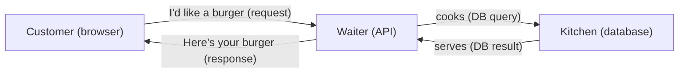

- **You (the browser / frontend app)** place an **order** → that's the API request.
- **The waiter (the API server)** takes the order to the **kitchen (the database)**.
- The kitchen prepares the food, the waiter brings it back → that's the **API response**.

A **REST API** is just an API that follows a few simple conventions:

- Uses standard HTTP methods (`GET` = fetch, `POST` = create, `PUT` = update, `DELETE` = remove).
- Talks in **JSON** (a plain-text data format).
- Each "thing" you manage (products, in our case) gets its own **URL path**.

---

## 🎯 What does this project do?

This project is a **Product Management API**. It lets any frontend (or curl, or Postman) do this:

| You send…                              | The API does…         |
| -------------------------------------- | --------------------- |
| `GET /api/products`                    | Returns all products  |
| `GET /api/products/123`                | Returns product #123  |
| `POST /api/products` with product data | Creates a new product |
| `PUT /api/products/123` with new data  | Updates product #123  |
| `DELETE /api/products/123`             | Removes product #123  |

Each product has a **name**, **quantity**, **price**, and optional **image**.

---

## 🧰 Tech stack — and _why_ each piece was chosen

Here's every technology in this project, what it does, and **why we picked it**.

### The runtime & language

| Tech                      | What it is                                                                         | Why we use it                                              |
| ------------------------- | ---------------------------------------------------------------------------------- | ---------------------------------------------------------- |
| **Node.js**               | A runtime that lets us run **JavaScript on the server** (not just in the browser). | Fast, huge ecosystem, same language on frontend + backend. |
| **JavaScript (CommonJS)** | The language. `require(...)` style (see `"type": "commonjs"` in `package.json`).   | Standard, no build step needed, beginner-friendly.         |

### The web framework

| Tech                      | What it is                                     | Why we use it                                                                                          |
| ------------------------- | ---------------------------------------------- | ------------------------------------------------------------------------------------------------------ |
| **Express 5** (`express`) | A minimal, flexible web framework for Node.js. | Handles routing (`/`, `/api/products/:id`), parsing JSON bodies, middleware chains. Industry standard. |

### The database layer

| Tech                        | What it is                                                                                               | Why we use it                                                                                                 |
| --------------------------- | -------------------------------------------------------------------------------------------------------- | ------------------------------------------------------------------------------------------------------------- |
| **MongoDB**                 | A **NoSQL document database**. Data is stored as flexible JSON-like "documents" instead of rigid tables. | Great for product catalogs; schema can evolve easily.                                                         |
| **Mongoose 9** (`mongoose`) | An **ODM** (Object-Document Mapper) for MongoDB. Wraps MongoDB with a nice schema + model API.           | Gives us validation, types, `createdAt`/`updatedAt` timestamps, and easy queries like `Product.findById(id)`. |

### Helpers / utilities

| Tech                      | What it is                                                    | Why we use it                                                                                                                                                  |
| ------------------------- | ------------------------------------------------------------- | -------------------------------------------------------------------------------------------------------------------------------------------------------------- |
| **dotenv** (`dotenv`)     | Loads secrets from a `.env` file into `process.env`.          | Keeps DB passwords and config out of source code.                                                                                                              |
| **cors** (`cors`)         | Middleware that adds CORS headers to responses.               | Lets a frontend hosted on a different domain (e.g. `localhost:5173`) call this API safely.                                                                     |
| **express-async-handler** | A tiny wrapper that catches errors in `async` route handlers. | Without it, a thrown error in an `async` function would crash the server or hang forever. With it, errors are forwarded to our error middleware automatically. |

### Dev tooling

| Tech                    | What it is                                                    | Why we use it                                                   |
| ----------------------- | ------------------------------------------------------------- | --------------------------------------------------------------- |
| **Nodemon** (`nodemon`) | A dev server that **auto-restarts** Node when a file changes. | Saves you from manually stopping & restarting after every edit. |

### Every npm install command used (and why)

```bash
# Runtime deps (production)
npm install express          # web framework
npm install mongoose          # talk to MongoDB with schemas
npm install dotenv            # load .env into process.env
npm install cors              # allow cross-origin requests from the frontend
npm install express-async-handler   # catch errors from async route handlers

# Dev dep (only used while developing)
npm install --save-dev nodemon       # auto-restart on file change
```

> 💡 `--save-dev` means "only needed while coding, not when the app runs in production".

---

## 🗂 Project structure — folder by folder

```
Node API/
│
├── server.js                  # 🚪 The front door. Boots Express, connects MongoDB, starts listening.
│
├── controller/                # 🧠 The "brain" — handles requests, talks to the model
│   └── productController.js   #    5 functions: list / get / create / update / delete
│
├── models/                    # 🗄 The "data shape" — describes what a Product looks like
│   └── productModel.js        #    Mongoose schema + Product model
│
├── routes/                    # 🛣 The "map" — URL → which controller function runs
│   └── productRoute.js        #    Wires HTTP methods to controller functions
│
├── middleware/                # 🛡 Helpers that run between request and response
│   └── errorMiddleware.js     #    Catches errors and sends a clean JSON response
│
├── .env_example               # 📄 Template for your own .env (copy → rename → fill in)
├── .env                       # 🔒 YOUR secrets (NOT committed — see .gitignore)
├── .gitignore                 # 🚫 Tells Git to ignore node_modules and .env
├── package.json               # 📦 Project metadata + dependencies + npm scripts
├── package-lock.json          # 🔒 Exact pinned versions of every dep (auto-generated)
├── mvc.png                    # 🖼  Reference image of the MVC pattern
└── README.md                  # 📖 You are here
```

### What is MVC?

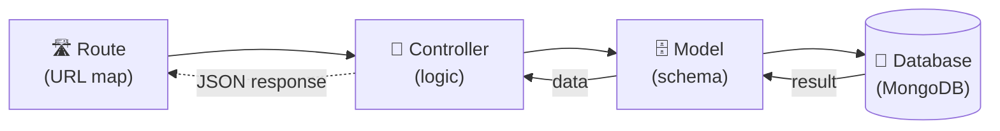

- **Route** = "someone asked for `GET /api/products/123`, here is who handles it".
- **Controller** = "do the work: ask the model for the data, build the response".
- **Model** = "the shape of a Product, plus the actual DB calls".

---

## 🔁 How the code flows (big picture diagram)

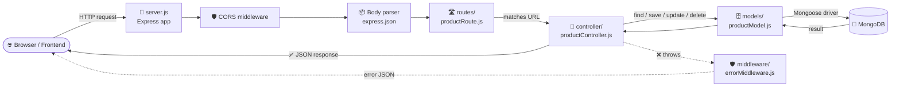

**In plain English:**

1. The browser sends an HTTP request.
2. `server.js` runs **CORS** (so the browser is allowed to call us).
3. Then runs **body parsers** (so we can read JSON / form data).
4. Then matches the URL to a **route**.
5. The route calls the right **controller function**.
6. The controller asks the **Product model** to talk to MongoDB.
7. The controller builds a **JSON response** and sends it back.
8. If anything throws, the **error middleware** turns it into a clean JSON error.

---

## 🚦 Request lifecycle — step by step

### Example: `GET /api/products/123`

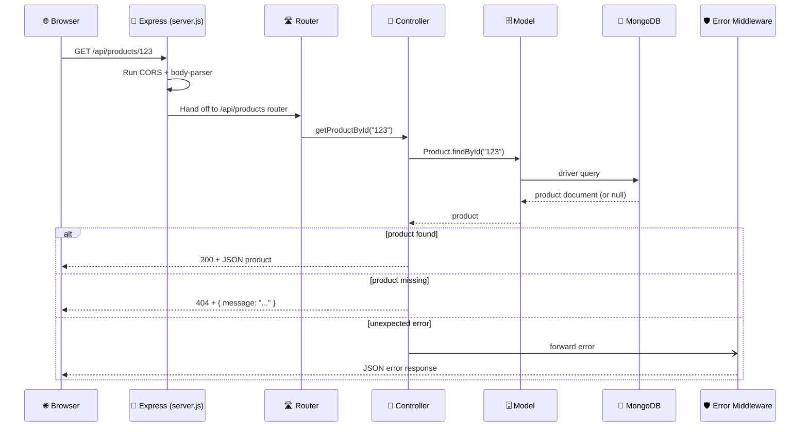

### Example: `POST /api/products` (create)

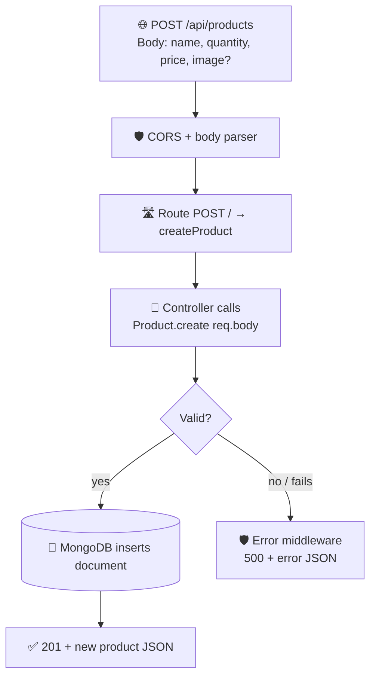

### Example: `PUT /api/products/:id` (update)

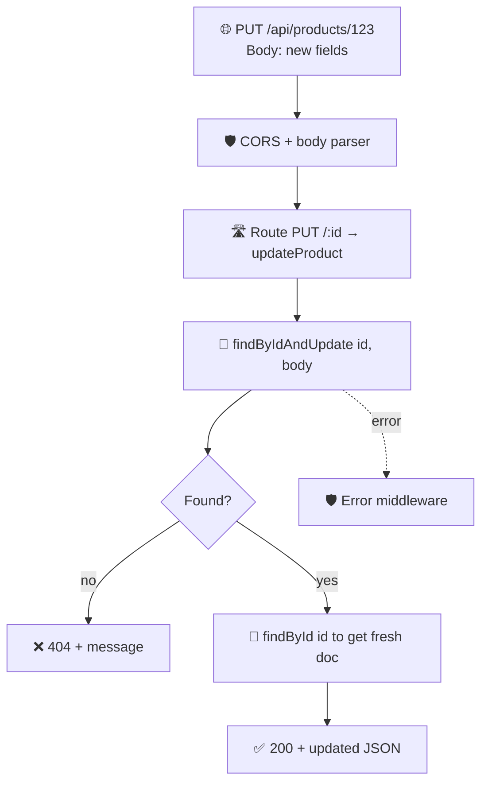

### Example: `DELETE /api/products/:id`

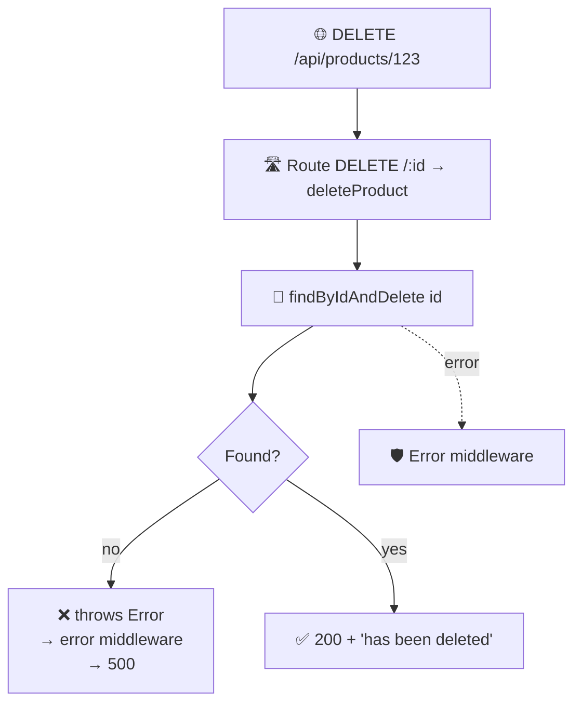

---

## 🗄 Database layer — how Mongoose talks to MongoDB

### The Product schema

```js
// models/productModel.js
{
  name:     { type: String, required: true },     // must have a name
  quantity: { type: Number, required: true, default: 0 },
  price:    { type: Number, required: true },     // must have a price
  image:    { type: String, required: false }     // optional
},
{ timestamps: true }                              // adds createdAt + updatedAt
```

Plus auto-fields from MongoDB:

- `_id` — unique document id
- `createdAt` / `updatedAt` — set by the `timestamps: true` option

### How the connection works

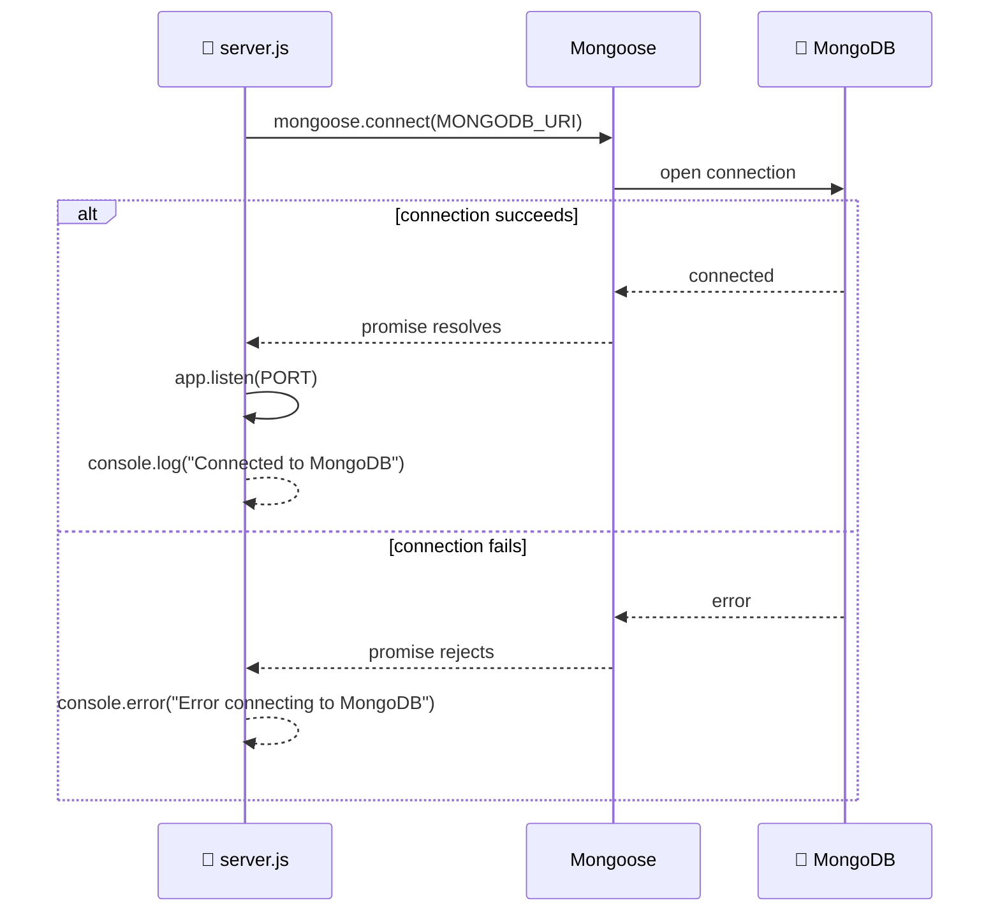

> ⚠️ If MongoDB fails to connect, the server **does not start listening**. This is intentional — we don't want a running API that can't reach its database.

---

## 🛡 Error handling flow

We use a **centralized error middleware**. Any error thrown (or `next(err)`-ed) lands here.

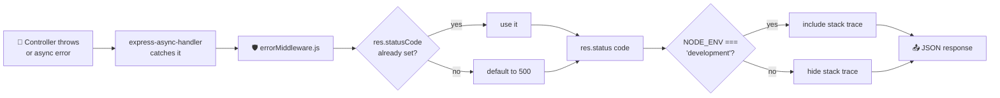

Response shape:

```json
{
  "message": "Cannot find any product with ID 123",
  "stack": "Error: ...\n    at ... (development only)"
}
```

In production, `stack` becomes `null`.

---

## 🚀 Getting started (run it on your machine)

### Prerequisites

You need three things:

1. **Node.js** (v18+ recommended) — [download](https://nodejs.org)
   - Comes with **npm** (Node Package Manager).
2. **A MongoDB database.** Two options:
   - **Local:** install [MongoDB Community](https://www.mongodb.com/try/download/community) and run it (default URL: `mongodb://127.0.0.1:27017/node-api`).
   - **Cloud (free):** create a free cluster on [MongoDB Atlas](https://www.mongodb.com/atlas) and grab the connection string.
3. **Git** (optional, for cloning).

### Step-by-step

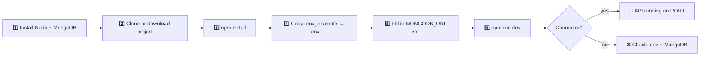

#### [1] Clone & enter

```bash
git clone <your-repo-url>
cd "Node API"
```

#### [2] Install dependencies

```bash
npm install
```

This reads `package.json` and downloads `express`, `mongoose`, `cors`, `dotenv`, `express-async-handler`, and (for dev) `nodemon` into a new `node_modules/` folder.

#### [3] Create your `.env`

```bash
cp .env_example .env       # macOS / Linux
copy .env_example .env     # Windows
```

Then open `.env` and fill in the values (see next section).

#### [4] Start the dev server

```bash
npm run dev
```

You should see:

```
Connected to MongoDB
Node API app is running on port 3000
```

🎉 Hit `http://localhost:3000` in your browser — you'll get `Hello NODE API`.

---

## 🔐 Environment variables reference

| Variable       | Required | Example                              | Purpose                                                                        |
| -------------- | -------- | ------------------------------------ | ------------------------------------------------------------------------------ |
| `MONGODB_URI`  | ✅ Yes   | `mongodb://127.0.0.1:27017/node-api` | MongoDB connection string. App **won't start** without it.                     |
| `PORT`         | ❌ No    | `3000`                               | Port the API listens on. Defaults to `3000` if unset.                          |
| `FRONTEND_URL` | ✅ Yes   | `http://localhost:5173`              | The one browser origin allowed to call this API (CORS). **No trailing slash.** |
| `NODE_ENV`     | ❌ No    | `development`                        | If `development`, error responses include the stack trace.                     |

> 🔒 `.env` is in `.gitignore` — it is **never** committed. Keep it that way.

---

## 📜 npm scripts — what each command does

| Command         | What runs           | What it does                                                                       |
| --------------- | ------------------- | ---------------------------------------------------------------------------------- |
| `npm install`   | (npm built-in)      | Downloads every package listed in `package.json` into `node_modules/`.             |
| `npm run serve` | `node server.js`    | Runs the API **once** with plain Node. Use this in production.                     |
| `npm run dev`   | `nodemon server.js` | Runs the API and **auto-restarts** whenever you save a file. Use while developing. |
| `npm test`      | placeholder echo    | Currently just prints `"Error: no test specified"` — no tests are wired up.        |

---

## 📖 API reference (every endpoint)

Base URL: `http://localhost:3000`

| Method   | Path                | Purpose           | Success | Error cases                    |
| -------- | ------------------- | ----------------- | ------- | ------------------------------ |
| `GET`    | `/`                 | Health / greeting | `200`   | —                              |
| `GET`    | `/blog`             | Demo greeting     | `200`   | —                              |
| `GET`    | `/api/products`     | List all products | `200`   | `500` on DB failure            |
| `GET`    | `/api/products/:id` | Get one product   | `200`   | `404` if not found             |
| `POST`   | `/api/products`     | Create a product  | `201`   | `500` on validation/DB error   |
| `PUT`    | `/api/products/:id` | Update a product  | `200`   | `404` if not found             |
| `DELETE` | `/api/products/:id` | Delete a product  | `200`   | `500` if not found (see below) |

### Product shape

```json
{
  "_id": "68d91ab0c134bf75af793fa1",
  "name": "Mechanical Keyboard",
  "quantity": 10,
  "price": 49.99,
  "image": "https://example.com/keyboard.jpg",
  "createdAt": "2026-09-29T...",
  "updatedAt": "2026-09-29T..."
}
```

### [1] List products — `GET /api/products`

```bash
curl http://localhost:3000/api/products
```

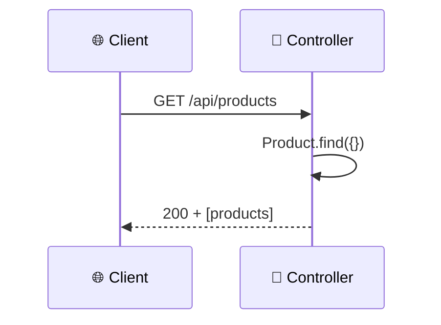

Empty database → `200` with `[]`.

### [2] Get one product — `GET /api/products/:id`

```bash
curl http://localhost:3000/api/products/68d91ab0c134bf75af793fa1
```

Not found:

```json
{ "message": "Cannot find any product with ID 68d91ab0c134bf75af793fa1" }
```

### [3] Create a product — `POST /api/products`

```bash
curl -X POST http://localhost:3000/api/products \
  -H "Content-Type: application/json" \
  -d '{"name":"Mechanical Keyboard","quantity":10,"price":49.99,"image":"https://example.com/keyboard.jpg"}'
```

Required body fields: `name`, `quantity`, `price`. `image` is optional.

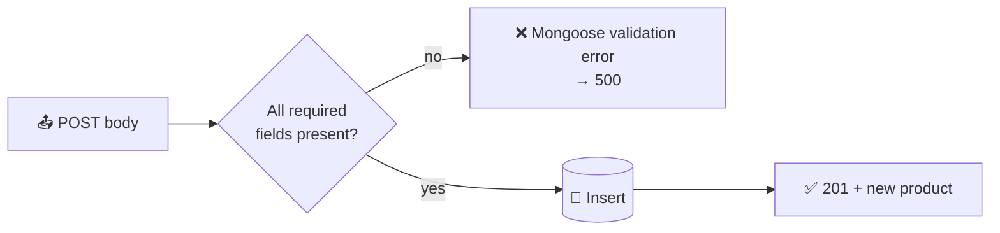

### [4] Update a product — `PUT /api/products/:id`

```bash
curl -X PUT http://localhost:3000/api/products/68d91ab0c134bf75af793fa1 \
  -H "Content-Type: application/json" \
  -d '{"price": 44.99, "quantity": 15}'
```

Only send the fields you want to change. The response is the **updated** product.

### [5] Delete a product — `DELETE /api/products/:id`

```bash
curl -X DELETE http://localhost:3000/api/products/68d91ab0c134bf75af793fa1
```

Success:

```json
{ "message": "Product with ID 68d91ab0c134bf75af793fa1 has been deleted" }
```

---

## 🔢 HTTP status codes used

| Code | Meaning      | When we use it                                  |
| ---- | ------------ | ----------------------------------------------- |
| 200  | OK           | Successful GET / PUT / DELETE                   |
| 201  | Created      | Successful POST (a new resource was created)    |
| 404  | Not Found    | Product with that id doesn't exist              |
| 500  | Server Error | Anything else: DB down, validation failed, etc. |

---

## Common beginner mistakes

| Mistake                                                               | Fix                                                              |
| --------------------------------------------------------------------- | ---------------------------------------------------------------- |
| Forgetting to start MongoDB before running the API                    | Run `mongod` (local) or check Atlas connection string            |
| `MONGDB_URI` typo                                                     | It must be **`MONGODB_URI`** (matches `process.env.MONGODB_URI`) |
| Putting a trailing slash in `FRONTEND_URL` (`http://localhost:5173/`) | Remove the trailing slash                                        |
| Committing `.env`                                                     | It's already in `.gitignore` — keep it that way                  |
| Editing `node_modules/`                                               | Never edit installed packages — edit your own code instead       |
| `npm run dev` not restarting                                          | Check your terminal — Nodemon only watches files in the project  |

---

## 🔭 Next steps / improvements

- Return `400` (not `500`) for malformed MongoDB IDs and validation failures.
- Preserve `404` in the delete handler (currently throws to error middleware → `500`).
- Enable Mongoose's `runValidators: true` on updates so bad data is rejected.
- Add automated tests (e.g. **Jest** + **Supertest**).
- Add request validation with **Zod** or **Joi**.
- Add authentication (e.g. **JWT**) so only logged-in users can write.
- Add a `Dockerfile` + `docker-compose.yml` with MongoDB for one-command setup.
- Add logging with **morgan** or **pino**.
- Add rate limiting with **express-rate-limit**.

---

Made with ❤️ as a beginner-friendly reference for building your first Express + MongoDB API.
