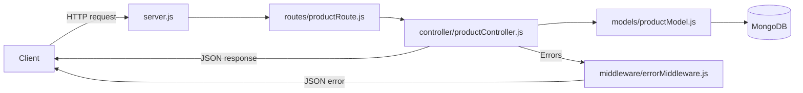

# Product API — Node.js, Express & MongoDB

A REST API for creating, reading, updating, and deleting products. It uses Express 5, Mongoose 9, and a router/controller/model structure.

## How it works



`server.js` loads environment variables, configures CORS and body parsing, mounts the product router at `/api/products`, registers error middleware, then starts listening after MongoDB connects. The controller performs database operations through the Product model. `express-async-handler` forwards thrown controller errors to the error middleware.

## Project structure

```text
Node API/
├── controller/
│   └── productController.js  # Product request handlers
├── middleware/
│   └── errorMiddleware.js    # JSON error responses
├── models/
│   └── productModel.js       # Product schema and model
├── routes/
│   └── productRoute.js       # Product endpoints
├── .env_example              # Example environment variables
├── package.json              # Dependencies and npm scripts
├── package-lock.json         # Locked dependency versions
├── README.md
└── server.js                 # Express configuration and startup
```

## Getting started

### Prerequisites

- Node.js and npm
- A local MongoDB database or MongoDB Atlas connection string

### 1. Install dependencies

```bash
npm install
```

### 2. Set environment variables

Copy `.env_example` to `.env` in the project root, then set your MongoDB connection string and frontend origin:

```env
NODE_ENV=development
MONGODB_URI=mongodb://127.0.0.1:27017/node-api
PORT=3000
FRONTEND_URL=http://localhost:5173
```

| Variable       | Purpose                                                                                           |
| -------------- | ------------------------------------------------------------------------------------------------- |
| `MONGODB_URI`  | MongoDB connection string required for startup                                                    |
| `PORT`         | Listening port; defaults to `3000` when unset                                                     |
| `FRONTEND_URL` | Allowed browser origin for CORS; set it to the exact frontend origin, without a trailing slash    |
| `NODE_ENV`     | Set to `development` to include stack traces in JSON error responses; otherwise `stack` is `null` |

Keep `.env` private; it is excluded by `.gitignore`. In a deployment environment, set these variables in the host's environment configuration. Set `FRONTEND_URL` to the deployed frontend's origin and use the host's assigned `PORT` if provided.

### 3. Start the API

```bash
npm run dev
```

`npm run dev` uses Nodemon to restart after file changes. To run once with Node.js, use `npm run serve`. After a successful database connection, the terminal prints `Connected to MongoDB` and the listening port. If MongoDB fails to connect, the server does not start listening.

The repository does not currently define a `test` script — `package.json` only exposes `serve` and `dev`.

With `PORT=3000`, the local base URL is `http://localhost:3000`.

## API reference

| Method   | Endpoint            | Purpose                     | Success |
| -------- | ------------------- | --------------------------- | ------- |
| `GET`    | `/`                 | Main greeting               | `200`   |
| `GET`    | `/blog`             | Blog greeting               | `200`   |
| `GET`    | `/api/products`     | List products               | `200`   |
| `GET`    | `/api/products/:id` | Get a product               | `200`   |
| `POST`   | `/api/products`     | Create a product            | `201`   |
| `PUT`    | `/api/products/:id` | Update and return a product | `200`   |
| `DELETE` | `/api/products/:id` | Delete a product            | `200`   |

Replace `:id` with a MongoDB document `_id`. The former `/products` and `/misc` routes are no longer registered.

### Product shape

| Field      | Type   | Required | Default | Description       |
| ---------- | ------ | -------- | ------- | ----------------- |
| `name`     | String | Yes      | —       | Product name      |
| `quantity` | Number | Yes      | `0`     | Available units   |
| `price`    | Number | Yes      | —       | Product price     |
| `image`    | String | No       | —       | Image URL or path |

Mongoose also adds `_id`, `createdAt`, and `updatedAt`.

### List products

```bash
curl http://localhost:3000/api/products
```

The response is a JSON array; an empty collection returns `[]`.

### Get one product

```bash
curl http://localhost:3000/api/products/68d91ab0c134bf75af793fa1
```

A valid ID with no matching product returns `404`:

```json
{ "message": "Cannot find any product with ID 68d91ab0c134bf75af793fa1" }
```

### Create a product

```bash
curl -X POST http://localhost:3000/api/products \
  -H "Content-Type: application/json" \
  -d '{"name":"Mechanical Keyboard","quantity":10,"price":49.99,"image":"https://example.com/keyboard.jpg"}'
```

The response is the created product document with status `201`.

### Update a product

```bash
curl -X PUT http://localhost:3000/api/products/68d91ab0c134bf75af793fa1 \
  -H "Content-Type: application/json" \
  -d '{"price":44.99,"quantity":15}'
```

The controller updates the document, fetches it again, and returns its new state. A valid ID with no matching product returns `404` with the same message format as the get route. The update currently does not enable Mongoose's `runValidators` option.

### Delete a product

```bash
curl -X DELETE http://localhost:3000/api/products/68d91ab0c134bf75af793fa1
```

Success returns `200` and:

```json
{ "message": "Product with ID 68d91ab0c134bf75af793fa1 has been deleted" }
```

## Errors and middleware

Express parses JSON and URL-encoded request bodies before routing. CORS allows the origin configured by `FRONTEND_URL` and returns status `200` for successful preflight requests.

The product controllers pass thrown errors through `express-async-handler` to `errorMiddleware.js`. Error responses include a `message` and a `stack` field. The stack contains a trace when `NODE_ENV=development` and is `null` otherwise:

```json
{ "message": "error details", "stack": null }
```

Missing products return `404` from the get and update handlers. The delete handler currently changes its missing-product error to `500` in its catch block. Malformed IDs and Mongoose validation errors also currently return `500`; the API does not yet classify them as `400` errors.

## Possible next improvements

- Return `400` for malformed IDs and invalid product input.
- Preserve the intended `404` status in the delete handler.
- Enable validation for updates with Mongoose's `runValidators` option.
- Add automated tests.
