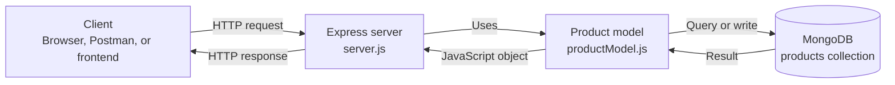
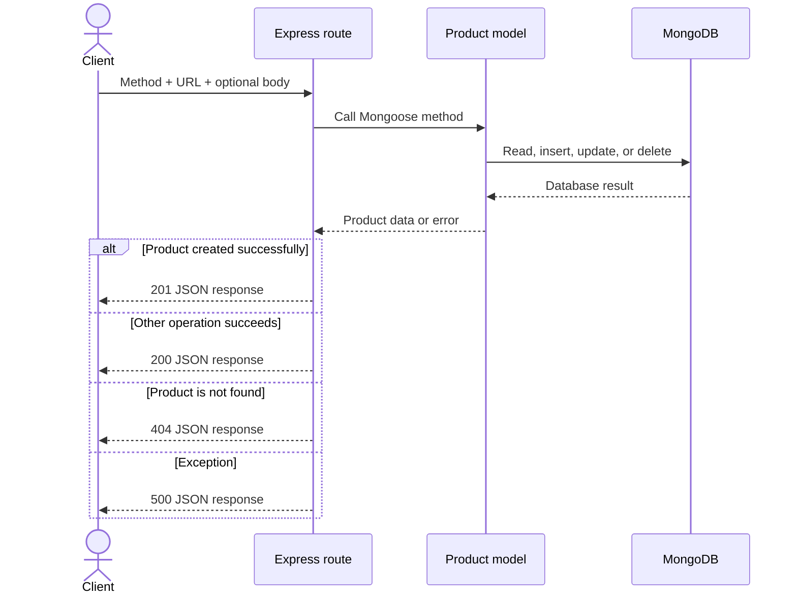
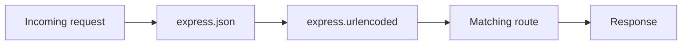
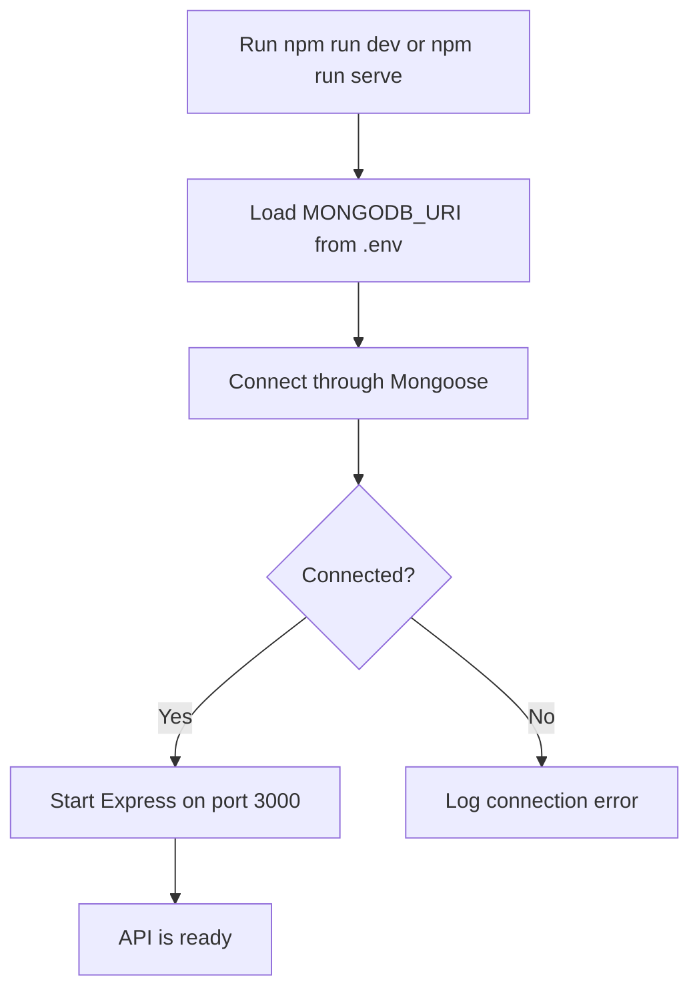

# Product API — Node.js, Express & MongoDB

> A beginner-friendly REST API that shows how a Node.js server receives requests, works with MongoDB, and returns JSON.


## What this project does

Clients such as a browser, Postman, a mobile app, or a frontend can use this API to create, read, update, and delete products. These operations are known as **CRUD**.

| Letter | Operation   | HTTP method | Endpoint                       |
| :----: | ----------- | :---------: | ------------------------------ |
| **C**  | Create data |   `POST`    | `/products`                    |
| **R**  | Read data   |    `GET`    | `/products` or `/products/:id` |
| **U**  | Update data |    `PUT`    | `/products/:id`                |
| **D**  | Delete data |  `DELETE`   | `/products/:id`                |

## How it fits together



In plain English: the client sends a request, Express matches a route, the `Product` model communicates with MongoDB, and Express sends the result back.

## Tech stack

| Tool         | Purpose                                            |
| ------------ | -------------------------------------------------- |
| **Node.js**  | Runs JavaScript outside the browser                |
| **Express**  | Defines the server, middleware, and routes         |
| **MongoDB**  | Stores product documents persistently              |
| **Mongoose** | Defines the product shape and queries MongoDB      |
| **dotenv**   | Loads the private MongoDB URI from `.env`          |
| **Nodemon**  | Restarts the development server after code changes |

## Project structure

```text
Node API/
├── models/
│   └── productModel.js   # Product schema and model
├── .env                  # Local secrets; ignored by Git
├── .gitignore            # Git ignore rules
├── package.json          # Dependencies and npm commands
├── package-lock.json     # Exact dependency versions
├── README.md             # Documentation
└── server.js             # Middleware, routes, DB connection, startup
```

## Getting started

### Prerequisites

- [Node.js](https://nodejs.org/) and npm
- A local MongoDB database or [MongoDB Atlas](https://www.mongodb.com/atlas) cluster
- Postman or Insomnia (optional)

### 1. Install dependencies

```bash
npm install
```

### 2. Configure MongoDB

Create `.env` in the project root:

```env
MONGODB_URI="your-mongodb-connection-string"
```

Never put the real URI in source code or commit `.env`. The existing `.gitignore` excludes it.

### 3. Start the API

Development mode (automatically restarts after file changes):

```bash
npm run dev
```

Run once with Node.js:

```bash
npm run serve
```

After MongoDB connects successfully, the terminal displays:

```text
Connected to MongoDB
Node API app is running on port 3000
```

The base URL is **`http://localhost:3000`**.

> The server listens only after MongoDB connects. If the connection fails, the error is logged and port `3000` is not opened.

## API reference

### Route overview

|  Method  | Endpoint        | Purpose                     | Success |
| :------: | --------------- | --------------------------- | :-----: |
|  `GET`   | `/`             | Main greeting               |  `200`  |
|  `GET`   | `/blog`         | Blog greeting               |  `200`  |
|  `GET`   | `/misc`         | Miscellaneous greeting      |  `200`  |
|  `GET`   | `/products`     | Fetch all products          |  `200`  |
|  `GET`   | `/products/:id` | Fetch one product           |  `200`  |
|  `POST`  | `/products`     | Create a product            |  `201`  |
|  `PUT`   | `/products/:id` | Update and return a product |  `200`  |
| `DELETE` | `/products/:id` | Delete a product            |  `200`  |

In a route, `:id` is a placeholder. Replace it with a real MongoDB `_id`, such as `68d91ab0c134bf75af793fa1`.

### Product shape

| Field      |  Type  | Required | Default | Description       |
| ---------- | :----: | :------: | :-----: | ----------------- |
| `name`     | String |   Yes    |    —    | Product name      |
| `quantity` | Number |   Yes    |   `0`   | Available units   |
| `price`    | Number |   Yes    |    —    | Product price     |
| `image`    | String |    No    |    —    | Image URL or path |

Mongoose adds `_id`. Since the schema enables `timestamps`, it also maintains `createdAt` and `updatedAt`.

```json
{
  "_id": "68d91ab0c134bf75af793fa1",
  "name": "Mechanical Keyboard",
  "quantity": 10,
  "price": 49.99,
  "image": "https://example.com/keyboard.jpg",
  "createdAt": "2026-09-28T10:00:00.000Z",
  "updatedAt": "2026-09-28T10:00:00.000Z"
}
```

### Get all products

```http
GET /products
```

```bash
curl http://localhost:3000/products
```

The response is a JSON array. An empty database returns `[]`.

### Get one product

```http
GET /products/:id
```

```bash
curl http://localhost:3000/products/68d91ab0c134bf75af793fa1
```

If the product exists, the route returns it with status `200`. If the ID is valid but no matching product exists, the route returns `404`:

```json
{
  "message": "Cannot find any product with ID 68d91ab0c134bf75af793fa1"
}
```

A malformed MongoDB ID still reaches the shared `500` error response because ID-format validation has not been added yet.

### Create a product

```http
POST /products
Content-Type: application/json
```

```bash
curl -X POST http://localhost:3000/products \
  -H "Content-Type: application/json" \
  -d '{"name":"Mechanical Keyboard","quantity":10,"price":49.99,"image":"https://example.com/keyboard.jpg"}'
```

The JSON body becomes `req.body`. Mongoose validates it against the schema, saves it, and the route returns the new document with status `201 Created`.

### Update a product

```http
PUT /products/:id
Content-Type: application/json
```

```bash
curl -X PUT http://localhost:3000/products/68d91ab0c134bf75af793fa1 \
  -H "Content-Type: application/json" \
  -d '{"price":44.99,"quantity":15}'
```

The route updates the matching document, fetches it again, and returns its new state. If no product matches, it returns `404`:

```json
{
  "message": "Cannot find any product with ID 68d91ab0c134bf75af793fa1"
}
```

### Delete a product

```http
DELETE /products/:id
```

```bash
curl -X DELETE http://localhost:3000/products/68d91ab0c134bf75af793fa1
```

Success response:

```json
{
  "message": "Product with ID 68d91ab0c134bf75af793fa1 has been deleted"
}
```

If no product matches, the route returns the same `404` message format as the update route.

## A request, step by step



### Understanding `req` and `res`

- `req` (**request**) describes what the client sent. This project reads `req.params.id` for URL IDs and `req.body` for product data.
- `res` (**response**) answers the client. This project uses `res.send()`, `res.status()`, and `res.json()`.

For `PUT /products/:id`:

```text
/products/68d91ab0c134bf75af793fa1
          └──────────────┬──────────────┘
                  req.params.id

JSON request body ────────────────> req.body
```

## Middleware explained

Middleware runs between the incoming request and its route handler.



```js
app.use(express.json());
app.use(express.urlencoded({ extended: false }));
```

- `express.json()` parses JSON into `req.body`.
- `express.urlencoded(...)` parses form-style URL-encoded bodies.

Without the appropriate parser, `POST` and `PUT` cannot reliably read submitted data.

## Database methods used

| Mongoose method                           | Route                  | Result                          |
| ----------------------------------------- | ---------------------- | ------------------------------- |
| `Product.find({})`                        | `GET /products`        | Finds every product             |
| `Product.findById(id)`                    | `GET /products/:id`    | Finds one product by `_id`      |
| `Product.create(req.body)`                | `POST /products`       | Validates and inserts a product |
| `Product.findByIdAndUpdate(id, req.body)` | `PUT /products/:id`    | Updates a matching product      |
| `Product.findByIdAndDelete(id)`           | `DELETE /products/:id` | Deletes a matching product      |

## Status codes used

|            Code             | Meaning in this server                                               |
| :-------------------------: | -------------------------------------------------------------------- |
|          `200 OK`           | The operation completed successfully                                 |
|        `201 Created`        | A new product was created successfully                               |
|       `404 Not Found`       | Get, update, or delete found no matching product                     |
| `500 Internal Server Error` | A database, validation, ID, or other server operation threw an error |

Caught route errors use this shape:

```json
{
  "message": "error details"
}
```

## Startup flow



This order prevents the API from accepting requests before its database is available.

## Beginner notes

- MongoDB stores records as **documents**, which resemble JSON objects.
- A Mongoose **schema** describes the fields a product may contain.
- A Mongoose **model** provides functions for its collection.
- The model `Product` maps to MongoDB's `products` collection by default.
- `async` and `await` allow routes to wait for database operations.
- `try...catch` turns thrown errors into JSON responses.
- The application currently uses the fixed port `3000`.

## Good next improvements

This README describes the current code exactly. Production-oriented next steps include:

- return `400 Bad Request` for malformed IDs or invalid input;
- enable update validation with Mongoose's `runValidators` option;
- split routes into router and controller modules;
- read the port from an environment variable; and
- add automated tests and centralized error handling.

These are suggestions, not features already implemented.

## Security

Never commit database credentials. If a MongoDB URI or password is exposed, rotate it in MongoDB Atlas immediately and update the local `.env` file.

---

Built as a practical introduction to REST APIs with Node.js, Express, Mongoose, and MongoDB.
